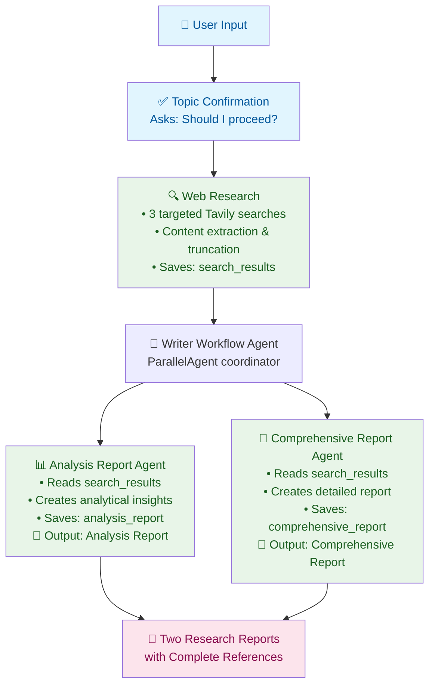

<div align="center">
  
  <br/>
  <h1>Research Assistant</h1>
  <b>Sample agent to assist with research tasks using the <code>@iqai/adk</code> library.</b>
  <br/>
  <i>Minimal • Extensible • TypeScript</i>
</div>

---

An AI-powered research assistant that conducts targeted web research and generates comprehensive reports. Features a streamlined workflow with topic confirmation, automated web search using Tavily API, and parallel report generation for efficient research assistance.

## Features

- 🔍 **Targeted Web Research**: Uses Tavily API for high-quality web search with content extraction
- 📊 **Dual Report Generation**: Creates analytical insights and comprehensive reports simultaneously
- 🤖 **Streamlined Workflow**: Single confirmation → 3 automated searches → parallel report generation
- 🛡️ **Smart Search Limiting**: Prevents excessive API usage with built-in 3-search maximum
- 📝 **State-Driven Architecture**: Agents communicate through structured state management
- 📄 **Professional Reports**: Both reports include complete references and citations
- 🎯 **Topic Agnostic**: Works with any research topic across all domains
- 💬 **User-Friendly**: Clear confirmation process with silent, efficient execution

> **Note**: This project demonstrates advanced agent orchestration in ADK-TS with parallel processing, state management, and tool integration.

## Architecture and Workflow

This project demonstrates efficient agent orchestration in ADK-TS with sequential data collection followed by parallel report generation:

1. **Root Agent** (`ai_research_assistant`) - Handles user interaction and orchestrates the complete workflow
2. **Writer Workflow Agent** (`writer_workflow_agent`) - ParallelAgent that coordinates simultaneous report generation
3. **Analysis Report Agent** (`analysis_report_agent`) - Generates analytical insights from search data
4. **Comprehensive Report Agent** (`comprehensive_report_agent`) - Creates detailed reports with references
5. **Tavily Search Tool** - Web search tool with state accumulation and search limiting

### Project Structure

```text
├── src/
│   ├── agents/
│   │   ├── agent.ts                      # Root orchestrator agent
│   │   ├── analysis-report-agent/
│   │   │   └── agent.ts                  # Analysis report generator
│   │   ├── comprehensive-report-agent/
│   │   │   └── agent.ts                  # Comprehensive report generator
│   │   └── writer-agent/                 # Parallel report coordinator
│   │       ├── agent.ts
│   │       └── tools/
│   │           └── TavilySearchTool.ts   # Web search with state management
│   ├── constants.ts                      # State key definitions
│   ├── env.ts                            # Environment configuration
│   └── index.ts                          # Main execution entry
```

### Data Flow



## Getting Started

### Prerequisites

- Node.js 18+
- LLM API key (OpenAI, Google, or other supported providers)
- Tavily API key for web search

### Installation

1. Clone this repository

```bash
git clone https://github.com/Timonwa/ai-research-assistant.git
cd ai-research-assistant
```

2. Install dependencies

```bash
pnpm install
```

3. Set up environment variables

```bash
cp .env.example .env
```

Edit `.env` and add your API keys:

```env
OPENAI_API_KEY=your_openai_api_key_here
LLM_MODEL=your_preferred_model_here
TAVILY_API_KEY=your_tavily_api_key_here
```

### Running the Assistant

```bash
# Development mode (with hot reloading)
pnpm dev

# Interactive testing with ADK CLI
adk run   # CLI chat interface
adk web   # Web interface
```

## Usage Examples

The assistant can research any topic and generate comprehensive reports with proper references. Here's a sample interaction:

```text
👤 User: Hi! Can you help me research the latest developments in quantum computing?
🤖 Agent: Hello! I understand you'd like me to research: the latest developments in quantum computing. Should I proceed with the research? (yes/no)
👤 User: Yes, please proceed!
🤖 Agent: [Performs 3 targeted web searches using Tavily API, then generates two reports]
```

**Example Research Topics:**

- "Latest trends in renewable energy technology 2024"
- "Impact of artificial intelligence on healthcare industry"
- "Market analysis for electric vehicles in Europe"
- "Recent developments in quantum computing"
- "Cybersecurity threats and solutions for small businesses"

**Generated Outputs:**

- **Analysis Report**: Key insights, trends, and analytical findings
- **Comprehensive Report**: Detailed information with complete source references and citations

## Useful Resources

### ADK-TS Framework

- [ADK-TS Documentation](https://adk.iqai.com/)
- [ADK-TS CLI Documentation](https://adk.iqai.com/docs/cli)
- [ADK-TS Samples Repository](https://github.com/IQAIcom/adk-ts-samples)
- [ADK-TS GitHub Repository](https://github.com/IQAICOM/adk-ts)

### APIs & Services

- [OpenAI API Keys](https://platform.openai.com/api-keys)
- [Tavily API Keys](https://app.tavily.com/)
- [Tavily Documentation](https://docs.tavily.com/welcome)

### Community

- [ADK-TS Discussions](https://github.com/IQAIcom/adk-ts/discussions)
- [Discord Community](https://discord.gg/w2Uk6ACK4D)

## Contributing

This AI Research Assistant is part of the [ADK-TS Samples](https://github.com/IQAIcom/adk-ts-samples) repository, a collection of example projects demonstrating ADK-TS capabilities.

We welcome contributions to the ADK-TS Samples repository! You can:

- **Add new sample projects** showcasing different ADK-TS features
- **Improve existing samples** with better documentation, new features, extend functionality, or better workflows and optimizations
- **Fix bugs** in current implementations
- **Update dependencies** and keep samples current

Please see our [Contributing Guide](CONTRIBUTING.md) for detailed guidelines.

## License

This project is licensed under the MIT License - see the [LICENSE](LICENSE) file for details.

---

**🎉 Ready to research?** This project showcases efficient AI research assistant implementation using ADK-TS framework with web search integration and parallel report generation.
