<div align="center">
  
  <br/>

# AI Research Assistant

**A sample project to build your own agent with the `@iqai/adk` library.**

_Minimal • Extensible • TypeScript_

</div>

---

An AI-powered research assistant that processes any research topic through three sequential agents, each producing distinct outputs: raw research findings, analytical insights, and a final structured report. Built with ADK-TS to demonstrate advanced agent orchestration and state management.

## Features

- 🔍 **Web Research Output**: First agent gathers and outputs raw research data from multiple sources using Google Search
- 📊 **Analysis Output**: Second agent provides analyzed findings and expert consensus  
- 📝 **Report Output**: Third agent delivers a final structured report  
- 🤖 **Sequential Processing**: Demonstrates how three agents work in sequence  
- 🛡️ **State Management**: Shows how agents pass data through session state  
- 💬 **Interactive Interface**: User-friendly greeting and topic confirmation system  
- 🎯 **Topic Agnostic**: Works with any research topic (technology, business, health, etc.)

> **Note**: This project currently uses the built-in Google Search tool that returns dummy data for demonstration purposes. For real data, you can extend it just as it's done in `GoogleSearchTool.ts` to fetch real results. You can use the `GoogleSearchTool` to test with real Google Custom Search API data.

## Architecture and Workflow

This project demonstrates sequential agent workflow in ADK-TS, where each agent produces its own distinct output:

1. **Data Collection Agent** - Raw research findings from web searches
2. **Analysis Agent** - Analytical insights and patterns from the research  
3. **Writer Agent** - A polished, structured final report

### Project Structure

```text
├── src/
│   ├── agents/
│   │   ├── agent.ts              # Root orchestrator agent
│   │   ├── data-collection-agent/ # Web research specialist
│   │   │   └── agent.ts
│   │   ├── analysis-agent/       # Content analysis specialist  
│   │   │   └── agent.ts
│   │   └── writer-agent/         # Report writing specialist
│   │       └── agent.ts
│   ├── env.ts                    # Environment configuration
│   └── index.ts                  # Main execution entry
```

### Data Flow

```mermaid
graph TB
    %% User Interaction
    User[👤 User Input] --> Greeting[💬 Interactive Greeting]

    %% Topic Confirmation
    Greeting --> Confirm[✅ Topic Confirmation<br/>Asks: Should I proceed?]

    %% Sequential Agent Workflow - 3 Distinct Outputs
    Confirm --> DataAgent[🔍 Data Collection Agent<br/>• Uses Google Search Tool<br/>• Creates Raw Findings<br/>• Saves: search_results<br/>📄 Output 1: Raw Research Data]

    DataAgent --> AnalysisAgent[📊 Analysis Agent<br/>• Reads search_results<br/>• Creates Insights<br/>• Saves: summarized_insights<br/>📄 Output 2: Analytical Insights]

    AnalysisAgent --> WriterAgent[📝 Writer Agent<br/>• Reads search_results + summarized_insights<br/>• Creates Final Report<br/>• Saves: final_report<br/>📄 Output 3: Structured Report]

    WriterAgent --> Output[📄 Three Distinct Research Outputs]

    %% Styling
    classDef userLayer fill:#e1f5fe,color:#01579b
    classDef confirmLayer fill:#fff3e0,color:#e65100
    classDef agentLayer fill:#e8f5e8,color:#1b5e20
    classDef outputLayer fill:#fce4ec,color:#880e4f

    class User,Greeting userLayer
    class Confirm confirmLayer
    class DataAgent,AnalysisAgent,WriterAgent agentLayer
    class Output outputLayer
```



## Getting Started

### Prerequisites

- Node.js 18+
- A Google API key for web search functionality

### Installation

1. Clone this repository

```bash
git clone https://github.com/IQAIcom/adk-ts-samples
cd agents/ai-research-assistant
```

2. Install dependencies

```bash
pnpm install
```

3. Set up environment variables

```bash
cp .env.example .env
```

Edit `.env` and add your API keys:

```env
GOOGLE_API_KEY=your_google_api_key_here
GOOGLE_CX=your_google_custom_search_engine_id_here
LLM_MODEL=gemini-2.5-flash
```

### Running the Assistant

```bash
# Development mode (with hot reloading)
pnpm dev

# Production build and run
pnpm build
pnpm start

# Interactive testing with ADK CLI
adk run   # CLI chat interface
adk web   # Web interface
```

## Usage Examples

The assistant can research any topic and generate comprehensive reports. Here are sample interactions:

```text
👤 User: Hi! Can you help me research cybersecurity threats and solutions for small businesses?
🤖 Agent: 👋 Hello! I understand you'd like me to research: cybersecurity threats and solutions for small businesses. Should I proceed with the research? (yes/no)
👤 User: Yes, please proceed!
🤖 Agent: [Research process outputs three distinct results]
```

**Example Queries:**

- "Latest trends in renewable energy technology 2024"
- "Impact of artificial intelligence on healthcare industry"
- "Market analysis for electric vehicles in Europe"
- "Recent developments in quantum computing"

## Useful Resources

- [ADK-TS Documentation](https://adk.iqai.com/)
- [ADK-TS CLI Documentation](https://adk.iqai.com/docs/cli)
- [Google Custom Search API Documentation](https://developers.google.com/custom-search/v1/overview)
- [GitHub Repository](https://github.com/IQAICOM/adk-ts)
- [Discord Community](https://discord.gg/w2Uk6ACK4D)

## Contributing

This AI Research Assistant is part of the [ADK-TS Samples](https://github.com/IQAIcom/adk-ts-samples) repository, a collection of example projects demonstrating ADK-TS capabilities.

We welcome contributions to the ADK-TS Samples repository! You can:

- **Add new sample projects** showcasing different ADK-TS features
- **Improve existing samples** with better documentation, code quality, or new features
- **Fix bugs** in current implementations
- **Update dependencies** and keep samples current

Please see our [Contributing Guide](CONTRIBUTING.md) for detailed guidelines.

## License

This project is licensed under the MIT License - see the [LICENSE](LICENSE) file for details.

---

**🎉 Ready to build?** This sample project provides a solid foundation for creating your own AI research assistant using the ADK-TS framework. Happy coding!

## TO DO

- [ ] Update `.env` and `env.ts` to use gemini model by default
- [ ] Update README and package.json with current features
- [ ] Ensure errors do not cause crashes but are handled gracefully
