<div align="center">
  
  <br/>

# AI Research Assistant

**A sample project to build your own agent with the `@iqai/adk` library.**

_Minimal • Extensible • TypeScript_

</div>

---

An AI-powered research assistant that processes any research topic through a sophisticated agent workflow: data collection with content extraction, followed by parallel analysis and report generation. Built with ADK-TS to demonstrate advanced agent orchestration, structured outputs, and state management.

## Features

- 🔍 **Smart Data Collection**: Searches web sources and extracts full article content from URLs
- 📊 **Parallel Analysis**: Analysis and comprehensive reports generated simultaneously
- 📝 **Structured Outputs**: Data collection agent uses Zod schema for consistent data structure
- 🤖 **Sequential + Parallel Processing**: Data collection → [Analysis + Report] parallel execution
- 🛡️ **State Management**: Agents pass structured data through session state
- 💬 **Interactive Interface**: User-friendly greeting and topic confirmation system
- 🎯 **Topic Agnostic**: Works with any research topic (technology, business, health, etc.)
- 📄 **Content Extraction**: Automatically extracts and processes full webpage content

> **Note**: This project currently uses the built-in Google Search tool that returns dummy data for demonstration purposes. For real data, you can extend it just as it's done in `GoogleSearchTool.ts` to fetch real results from Google Custom Search API.

## Architecture and Workflow

This project demonstrates advanced agent orchestration in ADK-TS with sequential data collection followed by parallel report generation:

1. **Root Agent** (`ai_research_assistant`) - Handles user interaction and topic confirmation
2. **Research Workflow Agent** (`research_workflow_agent`) - SequentialAgent that orchestrates the research process
3. **Data Collection Agent** (`data_collection_agent`) - Searches web sources and extracts full content from URLs
4. **Writer Workflow Agent** (`writer_workflow_agent`) - ParallelAgent that coordinates report generation
5. **Analysis Report Agent** (`analysis_report_agent`) - Generates analytical insights in parallel
6. **Comprehensive Report Agent** (`comprehensive_report_agent`) - Creates detailed reports in parallel

### Project Structure

```text
├── src/
│   ├── agents/
│   │   ├── agent.ts                      # Root orchestrator agent (ai_research_assistant)
│   │   ├── research-agent/
│   │   │   └── agent.ts                  # Sequential workflow coordinator (research_workflow_agent)
│   │   ├── data-collection-agent/        # Web research + content extraction (data_collection_agent)
│   │   │   ├── agent.ts
│   │   │   └── tools/
│   │   │       ├── GoogleSearchTool.ts
│   │   │       └── ContentExtractorTool.ts
│   │   ├── writer-agent/                 # Parallel writer coordinator (writer_workflow_agent)
│   │   │   └── agent.ts
│   │   ├── analysis-report-agent/        # Analysis specialist (analysis_report_agent)
│   │   │   └── agent.ts
│   │   └── comprehensive-report-agent/   # Report specialist (comprehensive_report_agent)
│   │       └── agent.ts
│   ├── env.ts                            # Environment configuration
│   └── index.ts                          # Main execution entry
```

### Data Flow

```mermaid
graph TB
    %% User Interaction
    User[👤 User Input] --> Greeting[💬 Interactive Greeting]

    %% Topic Confirmation
    Greeting --> Confirm[✅ Topic Confirmation<br/>Asks: Should I proceed?]

    %% Sequential Data Collection → Parallel Report Generation
    Confirm --> DataAgent[🔍 Data Collection Agent<br/>• Uses Google Search Tool<br/>• Extracts webpage content<br/>• Saves: search_results<br/>📄 Output 1: Raw Research Data]

    DataAgent --> WriterWorkflow[🔄 Writer Workflow Agent<br/>ParallelAgent coordinator]
    
    WriterWorkflow --> AnalysisAgent[📊 Analysis Report Agent<br/>• Reads search_results<br/>• Creates analytical insights<br/>• Saves: analysis_report<br/>📄 Output 2: Analysis Report]
    
    WriterWorkflow --> ReportAgent[📝 Comprehensive Report Agent<br/>• Reads search_results<br/>• Creates detailed report<br/>• Saves: comprehensive_report<br/>📄 Output 3: Comprehensive Report]

    AnalysisAgent --> Output[📄 Three Distinct Research Outputs]
    ReportAgent --> Output

    %% Styling
    classDef userLayer fill:#e1f5fe,color:#01579b
    classDef confirmLayer fill:#fff3e0,color:#e65100
    classDef agentLayer fill:#e8f5e8,color:#1b5e20
    classDef outputLayer fill:#fce4ec,color:#880e4f

    class User,Greeting userLayer
    class Confirm confirmLayer
    class DataAgent,WriterWorkflow,AnalysisAgent,ReportAgent agentLayer
    class Output outputLayer
```



## Getting Started

### Prerequisites

- Node.js 18+
- A Google API key for web search functionality

### Installation

1. Clone this repository

```bash
git clone https://github.com/IQAIcom/adk-ts-samples
cd agents/ai-research-assistant
```

2. Install dependencies

```bash
pnpm install
```

3. Set up environment variables

```bash
cp .env.example .env
```

Edit `.env` and add your API keys:

```env
GOOGLE_API_KEY=your_google_api_key_here
GOOGLE_CX=your_google_custom_search_engine_id_here
LLM_MODEL=gemini-2.5-flash
```

### Running the Assistant

```bash
# Development mode (with hot reloading)
pnpm dev

# Production build and run
pnpm build
pnpm start

# Interactive testing with ADK CLI
adk run   # CLI chat interface
adk web   # Web interface
```

## Usage Examples

The assistant can research any topic and generate comprehensive reports. Here are sample interactions:

```text
👤 User: Hi! Can you help me research cybersecurity threats and solutions for small businesses?
🤖 Agent: 👋 Hello! I understand you'd like me to research: cybersecurity threats and solutions for small businesses. Should I proceed with the research? (yes/no)
👤 User: Yes, please proceed!
🤖 Agent: [Research process outputs three distinct results]
```

**Example Queries:**

- "Latest trends in renewable energy technology 2024"
- "Impact of artificial intelligence on healthcare industry"
- "Market analysis for electric vehicles in Europe"
- "Recent developments in quantum computing"

## Useful Resources

- [ADK-TS Documentation](https://adk.iqai.com/)
- [ADK-TS CLI Documentation](https://adk.iqai.com/docs/cli)
- [Google API Keys](https://aistudio.google.com/api-keys)
- [Google Custom Search API Documentation](https://developers.google.com/custom-search/v1/overview)
- [GitHub Repository](https://github.com/IQAICOM/adk-ts)
- [Discord Community](https://discord.gg/w2Uk6ACK4D)

## Contributing

This AI Research Assistant is part of the [ADK-TS Samples](https://github.com/IQAIcom/adk-ts-samples) repository, a collection of example projects demonstrating ADK-TS capabilities.

We welcome contributions to the ADK-TS Samples repository! You can:

- **Add new sample projects** showcasing different ADK-TS features
- **Improve existing samples** with better documentation, code quality, or new features
- **Fix bugs** in current implementations
- **Update dependencies** and keep samples current

Please see our [Contributing Guide](CONTRIBUTING.md) for detailed guidelines.

## License

This project is licensed under the MIT License - see the [LICENSE](LICENSE) file for details.

---

**🎉 Ready to build?** This sample project provides a solid foundation for creating your own AI research assistant using the ADK-TS framework. Happy coding!

## TO DO

- [ ] Update `.env` and `env.ts` to use gemini model by default
- [ ] Update README and package.json with current features
